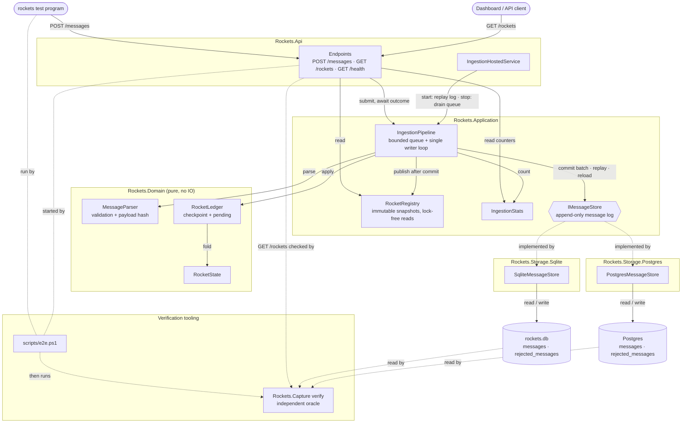
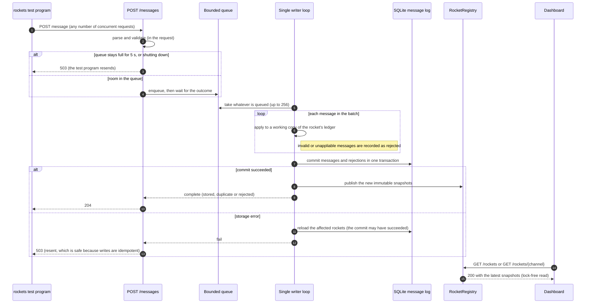

# Rockets

This is a service that consumes rocket messages and exposes each rocket's state through a REST API, written for Lunar's backend engineer challenge ([docs/CHALLENGE.md](docs/CHALLENGE.md)).

Messages arrive out of order and at least once. The service still:
- returns 2xx only for a message that is durably stored
- treats a redelivery as a duplicate
- shows the newest state of every rocket while being honest about how complete that state is

It is built with .NET 10 and ASP.NET Core minimal APIs. Messages are stored in SQLite by default, or in Postgres with one setting. Both stores sit behind the same storage interface and pass the same contract tests.

| | |
|---|---|
| Grading run (the test program's defaults: 100,000 messages, concurrency 3) | Passes in 38–52 s with durable commits, or 6.5 s with `Synchronous=Normal` |
| Verification | 318 automated tests (10 of them need Docker), plus end-to-end runs checked by an independent oracle (normal, crash/restart and stress on SQLite, and a default run on Postgres) |
| Design notes | [docs/decision-log.md](docs/decision-log.md) (per phase), [docs/implementation-plan.md](docs/implementation-plan.md) |
| How AI was used | [How AI was used](#how-ai-was-used), and every prompt in [docs/devdiary.md](docs/devdiary.md) |

## Quick start

You need the [.NET 10 SDK](https://dotnet.microsoft.com/download). The end-to-end script also needs [PowerShell 7](https://learn.microsoft.com/powershell/scripting/install/installing-powershell). The test program is included for every platform in `vendor/rockets/`.

```sh
# 1. Run the service; it listens on http://localhost:8088
dotnet run --project src/Rockets.Api -c Release

# 2. In another terminal, run the test program with its defaults
#    (use the binary for your platform: windows_amd64/rockets.exe, linux_amd64/rockets, darwin_arm64/rockets, ...)
vendor/rockets/windows_amd64/rockets.exe launch "http://localhost:8088/messages"

# 3. Look at the rockets
curl "http://localhost:8088/rockets?sortBy=speed&order=desc"
curl "http://localhost:8088/rockets/<channel>"
curl "http://localhost:8088/health"
```

- **Where the data goes:** messages are stored in `data/rockets.db` under the app's output folder, and the full path is logged at startup. State survives restarts: on startup the service replays the log, which takes about 0.2 s per 100,000 messages.
- **Settings:** override them on the command line, for example `--Storage:DatabasePath=/tmp/rockets.db` or `--Storage:Synchronous=Normal` (faster, but not safe against a power cut; see [Durability](#durability-and-acknowledgements)). They are defined in `src/Rockets.Api/appsettings.json`.

### Running on Postgres

```sh
docker compose up -d --wait        # Postgres 18 on localhost:5432 (development credentials)
dotnet run --project src/Rockets.Api -c Release -- --Storage:Provider=Postgres   --Storage:ConnectionString="Host=localhost;Database=rockets;Username=rockets;Password=rockets"
docker compose down -v             # remove the container and its data
```

## Tests and verification

```sh
dotnet test                                    # 318 tests; the 10 Postgres contract tests run in a Docker container and are skipped without Docker
pwsh ./scripts/e2e.ps1                          # end to end: 10,000 messages from the real test program, checked by the oracle
pwsh ./scripts/e2e.ps1 -Scenario all            # quick, default (grading run), crash/restart, stress
dotnet run -c Release --project tools/Rockets.StoreBenchmark   # SQLite commit throughput and replay time
```

Run a single test with `dotnet test --project tests/<Project> --filter-method "*Name*"`.

## API

| Endpoint | Description |
|---|---|
| `POST /messages` | Ingest a message. Returns **204** once the message is stored, and also for a duplicate or an invalid message, since none of these should be resent. Returns **503** if it can't be stored right now, so the test program resends it. |
| `GET /rockets/{channel}` | One rocket, or 404 |
| `GET /rockets?sortBy=…&order=…` | All rockets. `sortBy` is one of `channel` (default), `type`, `mission`, `speed`, `status`, `launchedAt` or `updatedAt`. `order` is `asc` (default) or `desc`. Both are case-insensitive. Rockets without a value sort last, ties are broken by channel, and an unknown value gets 400. |
| `GET /health` | Liveness, plus counters: stored, duplicates, rejected, payload mismatches, storage failures and commits |

`GET /rockets?sortBy=speed&order=desc` (shortened):

```json
{
  "count": 20,
  "rockets": [
    {
      "channel": "98b02c03-4e00-581b-8d12-605118a2cdf8",
      "type": "Antares",
      "mission": "APOLLO_SOYUZ",
      "speed": 26000,
      "status": "exploded",
      "explosionReason": "PRESSURE_VESSEL_FAILURE",
      "launchedAt": "2026-10-01T17:39:42.8989223+02:00",
      "updatedAt": "2026-10-01T17:39:44.0323246+02:00",
      "sequence": {
        "lastMessageNumber": 708,
        "checkpointMessageNumber": 708,
        "pendingMessageCount": 0,
        "missingMessageCount": 0,
        "isComplete": true
      }
    }
  ]
}
```

- **Fields:**
  - `status` is `awaitingLaunch`, `launched` or `exploded`.
  - `updatedAt` is the `messageTime` of the newest message applied.
- **`sequence`** tells a dashboard whether the state is exact: `isComplete` is false while messages are missing.
- **The envelope:** the list is an object rather than a bare array, so paging or other fields can be added without breaking clients.
- **Errors:** they are returned as RFC 9110 problem details.

## How it works

The components and how they depend on each other. Each box is a project. Solid arrows are calls and data flow. Dashed lines are the storage interface's implementations and the verification tooling.



What happens to a single message, from request to acknowledgement and from commit to read:



**The ordering model: checkpoint plus pending.** Each rocket has an immutable `RocketLedger`:
- **Checkpoint:** the exact state after messages 1…N, where N is the highest number reached with no gaps.
- **Pending:** the messages received above N, sorted by number.
- **Current state:** the checkpoint with the pending messages applied in order, skipping gaps. The API returns this, so a dashboard sees the newest data straight away, not only once a gap is filled.
- **Filling a gap** moves the checkpoint forward through the pending messages. Each message costs O(number pending), and state is never rebuilt from scratch.
- **A duplicate** is a number at or below N, or already pending.

The developer proposed this model; it puts the newest data ahead of always being exactly correct. With today's message types, applying messages in any order happens to give the same result. Checkpoint plus replay was chosen anyway because it stays correct if a future message depends on order, such as setting an absolute speed.

### Durability and acknowledgements

- **The message log is the only stored state.** It is an append-only SQLite table keyed on `(channel, messageNumber)`. Rocket state is derived from it by replay at startup, and nothing else is written to disk.
- **2xx means durable.** A request completes only after its batch is committed with `synchronous=FULL`, so it survives a power cut as well as a process crash. Snapshots are published only after the commit, so a reader never sees state that could be rolled back.
- **Idempotent.** Redeliveries are recognised by the ledger and by the table's primary key. If a redelivery's content differs, the first write wins, and the difference is counted and logged.
- **Errors stay with the message that caused them.**
  - An invalid message, or one that can't be applied (such as a speed overflow), is recorded in `rejected_messages` and answered with 2xx, because the test program would otherwise retry it forever. The rest of its batch carries on.
  - A storage error fails the batch with 503, which is safe to resend. Before anyone gets an answer, the affected rockets are reloaded from the database, because the commit may have succeeded. A rocket that can't be reloaded refuses its messages until it can.
- **Graceful shutdown** drains the queue. A client disconnecting never cancels a write that is already underway.

### Concurrency

Only the writer loop changes state, so the domain code has no locks. SQLite allows only one writer anyway, so a single writer that batches commits costs no parallelism. It also gives the system one clear place to order, apply and commit. Readers get immutable snapshots without locks.

## Design decisions and trade-offs

Each phase's reasoning and measurements are in [docs/decision-log.md](docs/decision-log.md). The main decisions:

| Decision | Chosen | Alternatives and why not |
|---|---|---|
| Persistence | **SQLite** message log by default, behind `IMessageStore`. A Postgres store is selectable with `Storage:Provider=Postgres`, and both pass the same contract tests. | Postgres as the default would need Docker for reviewers to run it, so it is optional. In-memory would lose messages that were already acknowledged. |
| Ordering | **Checkpoint plus pending replay**: newest data first, with completeness shown in `sequence` | Waiting until gaps fill (stale data). Refolding all messages each time (O(n)). O(1) updates that rely on messages applying in any order (breaks with order-dependent messages). |
| Recovery | **Replay the full log** at startup (0.2 s per 100k messages) | Saving checkpoints to disk: an independent review flagged that a projection bug would then be saved too. |
| Concurrency | **Single writer with group commit**, lock-free reads | A lock per rocket: one disk sync per message, and SQLite serialises writes anyway. |
| Durability | **`synchronous=FULL`** (the developer's choice), with `NORMAL` configurable | NORMAL: the grading run takes 6.5 s instead of 38–52 s, but the last commits can be lost in a power cut. |
| Invalid messages | **Recorded and answered with 2xx** | 4xx: the test program retries 4xx just like 5xx (measured), so a message that can never succeed would loop. |
| Topology | **One service** with internal layers (Domain, Application, Storage, Api) | Separate ingest and query services: more moving parts than the problem needs today (see [Scaling](#scaling)). |
| API shape | Nested `sequence`, list as `{ count, rockets }`, no filtering yet (all the developer's choices) | A flat rocket object. A bare array, which can't gain fields later without breaking clients. |

**Measured facts that shaped the design** (Phase 0, by running the test program against a capture server):
- Seed 444 always sends the same messages.
- Reordering comes only from concurrent requests: up to 279 positions late.
- There are no duplicates unless the service fails or responds slowly.
- 4xx, 5xx and refused connections are all retried every 500 ms.
- The client times out after about 10 s and then resends, which creates duplicates.
- Retries still waiting when the program finishes are dropped, yet it exits 0. So the service must avoid 503s near the end of a run.

## Verification

| Layer | What it shows |
|---|---|
| Domain (246 tests) | Every message type, plus validation and payload hashing. 200 seeded runs shuffle and redeliver messages and check the ledger after *every* delivery against a simple in-order fold. |
| Storage contract (23) | The same 10 contract tests run against SQLite and against Postgres (in a Testcontainers container, skipped without Docker): atomic commits, duplicates and content mismatches, ordered reads, and a failed commit leaving nothing behind. There are also 3 SQLite-specific tests: data surviving a reopen, and the pragmas. |
| Ingestion pipeline (14) | A fake store that can hold, fail, or commit and then throw, which exercises batching, error isolation, reloading after an ambiguous commit, stale rockets, a full queue, shutdown draining and disconnects. |
| HTTP API (16) | The real host on a temporary database: response shapes, sorting, status codes, 503 on a storage failure, and state across a restart. |
| Capture tool and oracle (19) | The tools that the measurements and the end-to-end check rely on. |
| Mutation checks | Bugs deliberately planted in the domain, the store and the pipeline (13 in all) were each caught by the tests. |
| End to end (`scripts/e2e.ps1`) | The real test program against the Release service, checked by an **independent oracle**, described below. |

The **oracle** (`tools/Rockets.Capture`, `expect` and `verify`) shares no code with the service.
- It folds every rocket from a seed-444 capture made against a different server, then compares the result with `GET /rockets`.
- It reads the service's SQLite log directly to confirm that every expected message is stored with identical content.
- The expected states are in `tests/e2e/`, and `-RegenerateExpected` recaptures them.

| Scenario | Messages | Time | Retries by the test program | Duplicates | Oracle |
|---|---:|---:|---:|---:|---|
| quick | 10,000 | 5.3 s | 0 | 0 | PASS |
| default (grading run) | 100,000 | 52.0 s | 0 | 0 | PASS |
| crash: hard kill mid-run, then restart | 10,000 | 36.3 s | 3,201 | 1 | PASS |
| stress: concurrency 20 | 100,000 | 48.2 s | 0 | 0 | PASS |
| default on **Postgres** (`docker compose`) | 100,000 | 118.3 s | 0 | 0 | PASS, and PASS again after a restart replayed the log |

In the crash run, one message was committed just before the kill but never acknowledged. It was resent and recognised as a duplicate, and nothing was lost.

## Known limitations

- **Throughput with durable commits is about 2,000 messages/s here.** The test program barely overlaps its requests (the average batch is 1.1 even at concurrency 20), so every message pays one disk sync of about 0.5 ms, and batching can't help. `Synchronous=Normal` removes most of that cost, at the price of power-cut safety.
- **A gap that never fills** stops that rocket's checkpoint, and pending messages keep growing in memory. With at-least-once delivery this needs the sender to give up. That does happen: the test program drops retries still waiting when it finishes. It also happens when the service rejects a message it can't apply. The gap shows up as `missingMessageCount`.
- **One writer per instance, and one instance.** With SQLite the service is limited to one node. Postgres removes the single-file limit, but running several instances safely needs channel partitioning, which isn't built. The [scaling](#scaling) path below covers it.
- **Postgres is slower here:** about 850 messages/s (118 s for the default run). Every commit makes a network round trip into the Docker VM, plus a durable commit. Sending each batch in one round trip (multi-row `INSERT … ON CONFLICT` with `RETURNING`) is the obvious next optimisation.
- **Startup replays the whole log**: O(total messages). That is fast at this scale but grows without bound.
- **Rules the brief leaves open** are assumptions, documented in [docs/decision-log.md](docs/decision-log.md):
  - An exploded rocket keeps its status, but its other fields keep updating.
  - A later `RocketLaunched` resets the speed.
  - Speed isn't clamped at 0.
  - If a redelivered message's content differs, the first write wins.
- **Blame in rare cases:** if filling a gap makes an earlier pending message fail (e.g. an overflow), the gap-filler is the one rejected.
- **Not built:** authentication, paging, filtering, metrics beyond `/health`, and a limit on request body size beyond Kestrel's default.

## Scaling

1. **Partition by channel.** Rockets are independent, so N writers can each own a hash range of channels, each with its own store or shard. Reads are unaffected.
2. **Postgres.** The store exists (`Storage:Provider=Postgres`) and passes the same contract tests and end-to-end oracle as SQLite. Unlike SQLite, it allows concurrent writers. The next step is several service instances, each owning a set of partitions, assigned for example by consistent hashing or by a Kafka topic partitioned by channel.
3. **Split ingest and query.** Ingest only appends to the log. Query services build the rocket snapshots as a read model, and `RocketRegistry` is already that read model.
4. **Snapshots on disk** to bound startup replay, together with a "rebuild from the log" option and a test that a snapshot equals a full replay.

## Project layout

```
src/Rockets.Domain           messages, parsing and validation, RocketState, RocketLedger (pure, no IO)
src/Rockets.Application      IngestionPipeline (queue + single writer), RocketRegistry, the IMessageStore contract
src/Rockets.Storage.Sqlite   the SQLite store (all SQLite SQL lives here)
src/Rockets.Storage.Postgres the Postgres store (all Postgres SQL lives here); docker-compose.yml runs Postgres locally
src/Rockets.Api              composition root and endpoints
tests/                       unit, contract, pipeline and API tests; tests/e2e holds the oracle's expected states
tools/Rockets.Capture        capture server, traffic analysis and the oracle (developer tool)
tools/Rockets.StoreBenchmark SQLite commit and replay benchmark
scripts/                     e2e.ps1 (end to end), probe.sh (test program probing)
vendor/rockets/              the challenge's test program for every OS and architecture
docs/                        challenge brief, implementation plan, decision log, dev diary
```

## How AI was used

The solution was built with Claude Code as a pair programmer. Every prompt and its outcome are logged in [docs/devdiary.md](docs/devdiary.md).

**The workflow.**
- **Planning:** the work was planned first, in plan mode, as phases with targets that could be checked ([implementation-plan.md](docs/implementation-plan.md)).
- **Independent review:** a second agent, with fresh context and read-only access, reviewed the plan before any code was written. Its findings changed the design: an oracle with ground truth from outside the service, errors kept to the message that caused them, no checkpoints saved to disk, reloading after an ambiguous commit, and probing the test program first.
- **Phase by phase:** each phase was done in one go, presented with its results, and committed only when the developer said so.

**Decisions owned by the developer.** The assistant raised design choices as questions with trade-offs instead of deciding silently. The developer chose:
- SQLite, swappable for Postgres
- the checkpoint-and-replay ordering model, which was the developer's own idea
- a single writer and a single service
- `synchronous=FULL`
- the API shape (nested `sequence`, the envelope without a sort echo, no filtering)
- a self-contained repo, and committing straight to `main`

**What was delegated.**
- Scaffolding, the implementation and the tests
- Probing the test program
- Benchmarks and documentation drafts

All of it was checked against measurements rather than assumptions.

**How quality was kept.**
- **Tests first:** the tests were written before the code and confirmed to fail before the implementation.
- **Mutation checks:** after each green suite, bugs were planted to prove the tests can fail.
- **Repeated runs:** the concurrent tests were repeated to catch flakiness.
- **Independent oracle:** the end-to-end check uses its own ground truth.
- **The real program:** every phase that touched behaviour was run against the real test program.

**Where the AI got it wrong, and how that was caught.** These are all in the diary.
- The plan claimed group commit would help throughput. The review questioned it, and the benchmark and the end-to-end batch-size measurement showed it can't help with this client.
- The first real run of the service listened on port 5000, because configuration was read from the working directory. Running the actual test program caught it, and the fix made the content root the app's own folder.
- An ad-hoc "wait for the service" loop didn't fail when the service never came up. Later, a service started by an ad-hoc command was never stopped and kept holding the port. Both were found from inconsistent results, and both checks are now built into `scripts/e2e.ps1` and `scripts/probe.sh`.
- Diary entries were missed for two prompts during Phase 3. They were backfilled and marked as late.
