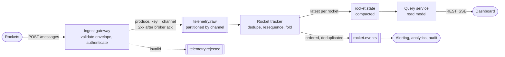

# Evaluation of the solution

Written 2026-10-06, against `main` at `bae5a22`. It is based on reading the source, the tests, the git history and the docs (`README.md`, `decision-log.md`, `implementation-plan.md`, `devdiary.md`). Nothing was run for this evaluation, so the test counts and timings quoted here are the repo's own claims, not re-measured.

## Summary

The solution is correct for the problem as posed, and it is well verified for its size. Its strongest parts are the things a reviewer will probe first: a 2xx means the message is durable, redelivery is idempotent, ordering has an explicit model, and the end-to-end check uses ground truth from outside the service.

The weak spots are of three kinds:
- **AI usage:** the record shows the developer owning the design, but it doesn't show the developer reviewing code. Every code-level error in the record was found by the assistant itself.
- **Robustness outside the test program's behaviour:** the service is safe against the vendored client, and much less so against a client that misbehaves.
- **Scope:** a lot was built for a 6-hour challenge, and some of it is generality the problem doesn't need yet.

It is a single-node design by construction. Getting to enterprise scale is mostly a matter of replacing the in-process queue and single writer with a partitioned log, and the code is already shaped in a way that makes that a re-hosting of the domain, not a rewrite.

## What is strong

- **The acknowledgement contract is right, and stated.** Commit first, then publish the snapshot, then answer (`IngestionPipeline.ProcessBatchAsync`). A reader never sees state that could roll back, and a 2xx is never given for a message that isn't on disk.
- **The ambiguous commit is handled.** After a storage error the affected rockets are reloaded before anyone is answered, and a rocket that can't be reloaded refuses messages. This is the failure most solutions miss.
- **Measured before designed.** Phase 0 probed the test program and three findings changed the design: 4xx is retried like 5xx, a non-2xx near the end of a run loses the message, and the client times out at about 10 s.
- **Immutability does real work.** Because `RocketLedger` is immutable, a failed apply or a failed commit needs no rollback code. The working copies are simply dropped.
- **The storage seam is proven, not just declared.** Two stores pass one contract-test suite, and the Postgres swap touched one `case` in the composition root.
- **Verification is layered.** Seeded shuffle-and-redelivery runs check the ledger after every delivery, a fake store drives the failure paths deterministically, and the oracle shares no code with the domain.
- **Limitations are stated honestly** in the README, including the ones that are uncomfortable (2,000 messages/s, group commit not helping with this client).

## AI usage

### What worked

- **Planning before code.** The design decisions that matter (storage, ordering, concurrency, topology) were discussed one at a time before any code existed, at the developer's insistence (diary entries 6–10).
- **A real design contribution from the developer.** The checkpoint-plus-pending model is the developer's idea (entry 9), and the developer overruled the assistant's suggestions on the API shape and on building a standalone executable.
- **An independent review that changed the design.** A second agent with fresh context found two high-severity problems in the plan: the oracle would have folded the service's own table, and one poison message would have failed its whole batch forever. Both were fixed before any code was written.
- **Claims were checked against measurements.** The plan's claim that group commit would help throughput was first questioned by the review, then disproved by the benchmark and by the `commits` counter.
- **The diary is unusually candid.** It records the assistant's own mistakes, including two entries it logged late.

### What could have been better

- **There is no evidence of code review by the developer.** After planning, the prompts are almost all "start phase N" and "commit it". The commit timestamps bound how long each phase took, including the assistant's own work:

  | Phase | Committed | Time since previous commit |
  |---|---|---:|
  | 1: domain model, 242 tests | 15:01 | 18 min |
  | 2: storage, benchmark | 16:24 | 83 min |
  | 3: pipeline and API | 17:20 | 56 min |
  | 4: oracle, e2e script | 17:43 | 23 min |
  | 5: README | 18:12 | 29 min |
  | 6: Postgres store | 18:24 | 12 min |

  The diary doesn't record a single case where the developer read a diff and asked for a change in code. The brief asks specifically "where you overrode or rewrote AI output". The record has good answers at the design level and none at the code level. If the code was read between "start phase" and "commit it", the record should say what was looked at and what was found.
- **The second agent reviewed the plan, never the code.** The plan says the review "can be repeated at the end of each phase". It wasn't. The 287-line `IngestionPipeline`, which is where the subtle bugs would be, was reviewed only by the agent that wrote it.
- **"Independent" is weaker than it sounds.** The reviewer and the oracle's author are the same model as the implementer. They share no code or context, but they share blind spots and the same reading of the brief. The oracle folds rockets with rules the same assistant inferred, so a shared misreading of the brief would pass.
- **Domain rules were decided by default.** The diary marks several decisions as ones "the developer can override in review", and none was revisited:
  - an exploded rocket keeps updating its other fields
  - a later `RocketLaunched` resets the speed
  - unknown message types are accepted and fill their place in the sequence
  - `by` must be non-negative
  - the first write wins when a redelivery differs
  
  The README lists these as assumptions, which is honest. But they are business rules, and they are exactly the questions an interviewer will ask "why?" about. They deserved an explicit decision each.
- **The quality claims can't be checked from the repo.**
  - *Tests first:* each phase is one commit, so the red step isn't in the history. Only the diary says it happened.
  - *Mutation checks:* the 17 planted bugs were manual and were reverted. Nothing in the repo can repeat them.
  - *The diary itself:* the assistant wrote it about its own work, including the list of "where the AI got it wrong".
- **The headline test count overstates coverage.** Of the 325 tests, 200 are the seeds of one theory (`RocketLedgerPropertyTests`). That test is valuable, but "325 tests" reads as more distinct behaviours than there are.
- **The record is long.** The README, the plan, the decision log and the diary come to about 1,800 lines, with overlap between them. A reviewer with limited time gets the important points diluted. The brief asks for a 10-minute, breadth-first presentation.
- **No guardrails outside the conversation.** There is no CI, so "tests pass" always means "the assistant said they passed on this machine".

### What to do differently next time

- Commit the failing tests before the implementation, so test-first shows in the history.
- Review each phase's diff, and write down what was read and what was changed as a result, in the developer's own words.
- Run the second-agent review on the code of the riskiest phase, and consider a different model for it.
- Put the domain-rule questions to the developer as a list before Phase 1, the way the API shape was handled in Phase 3.
- Add CI on the first day. It costs minutes and turns the quality claims into something a reviewer can see.
- Replace the manual mutation checks with a tool (Stryker.NET) so the result is repeatable.

## What could have been done better in the solution

### Robustness against a client that isn't the test program

These are the most important findings, because each one is a way to degrade or take down the service with valid HTTP.

- **A gap that never fills makes a rocket quadratic.** `RocketLedger.Apply` refolds every pending message on each new one. That is cheap when pending is small, and Phase 0 measured at most 279 positions of reordering. But if message 1 never arrives, or is rejected, every later message for that rocket is pending forever. Ten thousand such messages cost about fifty million applies, all on the single writer, and they block every other rocket. The README lists the memory growth but not the CPU cost.
- **Nothing is bounded per client.** Any caller can create any number of channels, each held in memory forever. `messageNumber` can be any positive 64-bit integer. There is no rate limit and no authentication.
- **Rejected bodies are stored whole.** An invalid body of up to Kestrel's default limit (about 30 MB) is written to `rejected_messages` and acknowledged. That is an easy way to fill the disk.
- **A rejected message leaves a permanent gap.** A message that fails to apply gets a 2xx and is never resent, so the rocket's checkpoint stops for good. The decision log accepts this for "absurd data". Combined with the first point, one absurd message is enough to make a rocket slow.
- **`/health` always says "healthy".** The status is a constant. It doesn't reflect stale rockets, storage failures or a full queue, so it can't serve as a readiness probe.
- **The writer has no timeout on a commit.** A store that hangs, as opposed to one that fails, stops the writer. Requests then time out at the queue after 5 s, but nothing detects or recovers the hang.

### Design

- **The ordering model is more general than today's messages need.** The diary itself notes that today's message types give the same result in any order, so an O(1) update would do. Checkpoint plus replay was kept for a future order-dependent message. That is a defensible choice and it was the developer's, but it is also the source of the quadratic case above, and of a good part of the domain code and tests. An interviewer may call it speculative.
- **`RocketLedger` does two jobs.** It resequences (duplicates, gaps, pending) and it folds rocket state. The first is generic and knows nothing about rockets. Separating them would make both easier to test and reuse. See the DDD section.
- **The wire format lives in the domain.** `MessageParser` uses `System.Text.Json` and SHA-256, and `RocketMessage` carries `PayloadJson` and `PayloadHash`. The domain project has no IO, but it does know the transport's JSON shape.
- **The payload hash depends on how the sender wrote the JSON.** It hashes the compact payload as received, so the same content with the properties in a different order counts as a mismatch. With one sender that never happens. With several producers or a re-encoding proxy it would produce false alarms.
- **Stored rows are re-validated on replay.** That is good (a corrupt row fails loudly), but it means tightening a validation rule in a later version can stop the service from starting. There is no event versioning or upcasting.
- **The log has no global position.** `messages` is keyed by `(channel, message_number)` and has no monotonic sequence. Nothing can read "everything since position X", which is what a second read model, an incremental snapshot or a downstream consumer would need.
- **`IngestionPipeline` carries a lot.** Queueing, batching, applying, the rejection policy, stale-rocket recovery and statistics are in one class. It reads well today, but it is the class every future change will touch.

### API

- No version in the path, no OpenAPI description, no paging and no filtering.
- Every `GET /rockets` copies and sorts the whole registry. That is fine for 20 rockets and wrong for 20,000.
- A dashboard has to poll. There is no push (SSE or WebSocket) and no `ETag` to make polling cheap.

### Delivery and housekeeping

- **Scope against the brief.** The brief suggests 6 hours and rewards "limitations you consciously accepted in favor of a simpler solution". The repo also contains a second store, a benchmark tool, a capture tool and an oracle. The verification tooling earns its place. The Postgres store is the part most likely to read as scope beyond the brief, especially as it is slower and its batch insert is left unoptimised.
- **Two script languages.** `e2e.ps1` needs PowerShell 7 and `probe.sh` needs bash.
- **No container image for the service**, although `docker-compose.yml` exists for Postgres.
- **55 MB of vendored binaries are in git history.**
- **A stray file:** `docs/How SQLite shapes concurrency.md` is untracked and has no `.md` structure. Either fold it into the decision log or delete it.

## Domain-driven design

### What is already there

- A pure domain project with no IO, which the other layers depend on.
- An immutable model with behaviour (`RocketLedger.Apply`, `RocketState.Apply`), not data classes with logic elsewhere.
- Payloads named as past-tense facts (`RocketLaunched`, `RocketExploded`), which is how domain events are named.
- A port for persistence (`IMessageStore`) owned by the application layer and implemented outside it.

### Where DDD would improve it

- **Strategic design first: there are three contexts in one model.**
  - *Telemetry ingestion:* receive, deduplicate, resequence, make durable. This is a generic subdomain. Nothing in it is about rockets.
  - *Rocket tracking:* what a rocket is, its lifecycle and its rules. This is the core domain.
  - *Dashboard query:* the shapes and sort orders a dashboard wants. This is a read model.
  
  Today the first two are fused in `RocketLedger`, and the third is partly in `RocketSnapshot`. Drawing these lines is the single most useful DDD step, because they are also the lines along which the system would be split to scale.
- **An anti-corruption layer at the edge.** The incoming messages belong to the rockets' context, not ours. Parsing, the JSON shape, the message-type strings and the content hash should sit in an adapter that translates into domain events. The domain would then hold `RocketLaunched(type, launchSpeed, mission)` and know nothing about `PayloadJson`.
- **A `Rocket` aggregate with the lifecycle made explicit.** `RocketState.Apply` is a `switch` in which the rules are implicit. "Launched once" and "exploded once" are stated in the brief and aren't modelled. A second launch silently resets the speed. An aggregate would name the states (awaiting launch, in flight, exploded) and the transitions between them.
  - One caveat matters here. The incoming messages are facts that already happened. The service can't refuse them the way an aggregate refuses a command. So an impossible transition shouldn't throw. It should be recorded as an anomaly (a domain event such as `RocketAnomalyDetected`) and the rocket should keep a defined state. This is a better answer to "what happens to messages after an explosion?" than the current silent assumption.
- **Value objects in place of primitives.** `Channel` (the rocket's identity), `MessageNumber`, `Speed` and `Mission` are strings and longs today. Types would carry their own validation, and a rule like "speed can't be negative" would have one home.
- **Ubiquitous language.** "Ledger", "checkpoint" and "pending" are the implementer's words. A domain expert would talk about a rocket's confirmed state, messages in flight and missing telemetry. The API already leans this way with `isComplete` and `missingMessageCount`.
- **Domain events going out.** The service consumes events and emits none. `RocketExploded` reaching the confirmed state, a gap being declared lost, or a redelivery with different content are all things other parts of a business would want to react to. Today they are a log line or a counter.

### How far to take it

The tactical patterns give modest returns here. This service is mainly a projection of someone else's facts. It has almost no decisions of its own to protect. A full aggregate-repository-factory structure would add ceremony without adding safety. The parts worth doing are the context split, the anti-corruption layer and the explicit lifecycle with anomalies.

## Event-driven architecture

### What is already there

The design is event sourcing in everything but name:
- the append-only message log is the only stored state
- rocket state is a fold over that log
- startup is a replay
- `RocketRegistry` is a projection, published after commit

So the move to an event-driven architecture is about transport and decoupling, not about changing the model.

### A target shape

- **The ingest gateway becomes thin.** It validates the envelope and produces to a durable log (Kafka or similar), keyed by channel, and returns 2xx once the broker has acknowledged with full replication. Durability moves from a local disk sync to a replicated log, which also removes the 2,000 messages/s ceiling.
- **Partitioning by channel replaces the single writer.** Each partition has one consumer at a time, so one rocket still has exactly one writer and the domain code stays lock-free. The consumer group handles which instance owns which rockets, and moves ownership when an instance dies. This is the "channel partitioning, which isn't built" from the README.
- **The resequencer is still needed.** A partition preserves arrival order, not `messageNumber` order. The tracker keeps today's logic: deduplicate on `(channel, messageNumber)`, hold messages above a gap, fold in order. `RocketLedger` moves across almost unchanged, which is the payoff of keeping it pure.
- **Two outputs, for two kinds of consumer.**
  - `rocket.events`: the clean stream, in order and without duplicates. Other teams consume this instead of re-solving ordering themselves.
  - `rocket.state`: a compacted topic with the latest state per rocket. Any number of query services can build a read model from it, in whatever store suits them.
- **Rejections go to a dead-letter topic** with a size cap, replacing the `rejected_messages` table.
- **The dashboard gets pushed updates** over SSE or WebSocket from the query service, instead of polling.

### What has to be solved on the way

- **A policy for gaps.** In a stream, "wait for the gap to fill" needs a deadline. After a timeout the gap is declared lost, an event says so, and the rocket moves on with its state marked as inexact. This also removes the quadratic case.
- **Snapshots.** Replay from the start of the log doesn't scale. The tracker stores a snapshot per rocket with the log position it covers, and a test proves a snapshot equals a full replay. This is the concern the plan review raised (M4), and the answer is the same: keep the log as the truth and keep the ability to rebuild.
- **Event versioning.** A schema registry, an explicit version on each event, and upcasters for old versions. Today's "unknown types are stored and skipped" is the right instinct and needs to become a rule.
- **Publishing without losing events.** If a database stays the source of truth, events must leave through a transactional outbox or change data capture, never by "write to the database, then publish".
- **Effectively-once processing.** The broker delivers at least once, so every consumer must be idempotent. The `(channel, messageNumber)` key already gives that.
- **A weaker read guarantee.** Today a 204 means the next `GET` shows the message. With asynchronous projection it means "accepted", and the read model catches up a moment later. The API has to say so, and the `sequence` fields are a good place to do it.

### Is it worth it?

Not for 20 rockets and one dashboard. The current design is the right size for the brief, and the README is right to describe this as the scaling path instead of building it. The value of this section is being able to show that the path exists and that the current code doesn't block it.

## What enterprise scale would take

Roughly in the order the gaps would hurt.

| Area | Today | Needed |
|---|---|---|
| Availability | One process. A restart is an outage. | Several instances behind a load balancer, with partition ownership and failover. |
| Throughput | About 2,000 messages/s, one disk sync per message | A replicated log for ingest, batch inserts, partitioned writers |
| Memory | Every rocket and every pending message is held forever | Bounds on pending per rocket, eviction of idle rockets, a gap deadline |
| Startup | Replays the whole log | Snapshots with a log position, and a rebuild option |
| Storage | One table, growing without limit. The schema is created with `CREATE TABLE IF NOT EXISTS`. | Retention and archiving, table partitioning, a migration tool, backup and restore with stated RPO and RTO |
| Security | None | Authentication of rockets (mTLS or signed messages), authorisation for readers, rate limits, body-size and field-length limits, secrets management |
| Observability | Log lines and counters on `/health` | Metrics, traces and structured logs (OpenTelemetry), alerts on lag, gaps, rejections and storage failures, separate liveness and readiness probes |
| API | Unversioned, no paging, polling only | Versioning, OpenAPI, paging and filtering, caching headers, push |
| Delivery | Run with `dotnet run`. No CI. | A container image, CI with the tests and the e2e run, automated deployment, load and failure tests in the pipeline |
| Data rules | First write wins, counted | An audit trail, a defined process for conflicting or late data, schema governance across producers |

**What carries over unchanged:** the acknowledgement contract, the idempotency key, the pure domain model, the storage contract tests and the idea of an oracle with outside ground truth.

**What gets replaced:** the in-process queue, the single writer, the in-memory registry as the only read model, and SQLite.

**AI usage at that scale.** The workflow used here doesn't transfer as it is. In a team it would need:
- pull requests with a human reviewer who didn't prompt the change
- CI as the authority on whether tests pass, not the assistant's report
- phases small enough to review properly, since a 12-minute phase with a whole new store in it is too big to read
- a written record of what the human verified, kept by the human
- agent review of code as a routine step, with a different model where possible
- limits on what an agent may do unattended: here it started and stopped Docker Desktop and killed processes, which is fine on a laptop and not on shared infrastructure

## Priorities

If only a little more time were spent, in this order:

1. **Bound the pending set** and declare long-lived gaps lost. This fixes the quadratic case and the unbounded memory in one change.
2. **Cap the request body and the stored rejection size.**
3. **Make the developer's code review visible**: one more pass over `IngestionPipeline` and `RocketLedger`, with notes in the developer's own words.
4. **Add CI** running `dotnet test` and the quick e2e scenario.
5. **Decide the five domain rules explicitly** and record who decided.
6. **Make `/health` tell the truth** about stale rockets and storage failures.
7. **Trim the docs** to what a reviewer needs for a 10-minute walkthrough.
